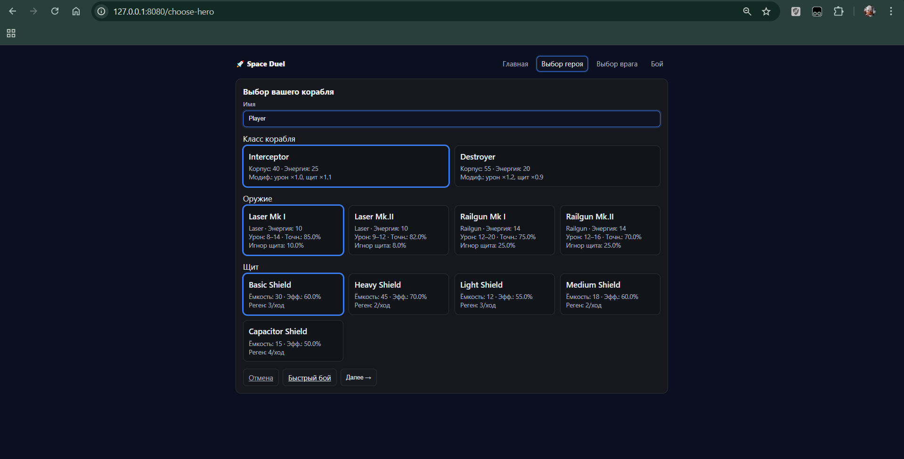

# Space Duel
[](../../actions/workflows/ci.yml)
[](../../actions/workflows/docker.yml)


Пошаговая браузерная дуэль двух космических кораблей. Интерфейс на Flask + Jinja2 + HTMX: кнопки «Удар / Скилл / Пасс / Сброс» обновляют только панель боя без перезагрузки страницы. Есть выбор кораблей/снаряжения, уровни сложности ИИ и телеметрия боя.

## Скриншоты




## Стек
- Python 3.12+, Flask 3.x, Jinja2, HTMX  
- marshmallow / marshmallow-dataclass (загрузка `equipment.json`)  
- pytest, mypy, ruff, pre-commit  
- gunicorn, Nginx, Docker / docker-compose

## Основные возможности
- Выбор класса корабля, оружия (laser/railgun) и щита из `equipment.json`.  
- Навыки: **Overcharge** (усиление урона), **EMP** (ослабление щита).  
- Уровни сложности ИИ: **easy / normal / hard**.  
- Телеметрия боя: попадания, урон по щиту и корпусу, расход энергии.  
- Статистика сессии (победы/поражения/ничьи, винрейт).

---

## Быстрый старт (Docker Compose)

```bash

cp .env.example .env
docker compose -f docker-compose.prod.yml up --build -d
```

Открой: http://127.0.0.1/

Маршруты:
- `/choose-hero` — выбор вашего корабля
- `/choose-enemy` — выбор противника и сложности ИИ
- `/fight` — бой (кнопки через HTMX)
- `/healthz` — health-probe (200 OK)

---

## Готовый образ (GHCR)

```bash

echo <PAT_с_read_or_write:packages> | docker login ghcr.io -u DeBugHowardDuck --password-stdin
docker pull ghcr.io/debughowardduck/space-duel-app:latest
docker run --rm -p 8000:8000 --env-file .env ghcr.io/debughowardduck/space-duel-app:latest
```
Открой: http://127.0.0.1:8000

---

## Локальный запуск (без Docker)

```bash

python -m venv .venv

# Windows PowerShell:
.\.venv\Scripts\Activate.ps1

# Linux/macOS:
source .venv/bin/activate

pip install -r requirements.txt
flask --app app run --debug
```
Открой: http://127.0.0.1:5000

---

## Конфигурация

Все переменные — через `.env` (см. `.env.example`):

```env
# Flask / runtime
SECRET_KEY=please-change-me
HOST=127.0.0.1
PORT=8000
LOG_LEVEL=INFO

# Параметры боя/ИИ
ARENA_RNG_SEED=42
AI_SKILL_CHANCE=0.10  # вероятность, что ИИ попробует применить скилл

# Gunicorn (в Docker)
GUNICORN_WORKERS=2
GUNICORN_TIMEOUT=30
```

Снаряжение хранится в `equipment.json`:

- `weapons`: `slug`, `name`, `kind` (laser/railgun), `dmg_min/max`, `energy_cost`, `shield_ignore`, `accuracy`  
- `shields`: `slug`, `name`, `capacity`, `efficiency`, `regen`

Изменили параметры — пересоберите Docker-образ или перезапустите dev-сервер.

---

## Тесты и качество

```bash

pytest -q
mypy --config-file=mypy.ini app tests
ruff check . && ruff format --check .
pre-commit run --all-files
```

Покрытие сосредоточено на формулах урона/энергии и сценариях боя.

---

## Сборка и запуск вручную (Docker, без compose)

```bash

docker build -f infra/docker/Dockerfile -t space-duel:dev .
docker run --rm -p 8000:8000 --name space-duel space-duel:dev
```
Открой: http://127.0.0.1:8000

---

## Структура проекта

```text
app/
  __init__.py
  web.py
  arena.py
  unit.py
  classes.py
  skills.py
  equipment.py
  stats.py
templates/
  base.html
  choose_hero.html
  choose_enemy.html
  fight.html
  _stats_box.html
  partials/
    fight_panel.html
    _stats_oob.html
    _telemetry_oob.html
static/
  styles.css
equipment.json
infra/
  docker/Dockerfile
  nginx/nginx.conf
docker-compose.prod.yml
wsgi.py
tests/
```

---

## CI / Release

- **ci** (`.github/workflows/ci.yml`) — на каждый пуш/PR: pre-commit → ruff → mypy → pytest.
- **release** (`.github/workflows/release.yml`) — по тегам `v*` или вручную: сборка Docker-образа и пуш в GHCR.

Выпуск релиза:
```bash
git tag -a v0.1.5 -m "Space Duel release"
git push origin v0.1.5
```

После этого доступны:
```
ghcr.io/debughowardduck/space-duel-app:latest
ghcr.io/debughowardduck/space-duel-app:v0.1.5

```

## License
MIT — см. [LICENSE](./LICENSE).
```
